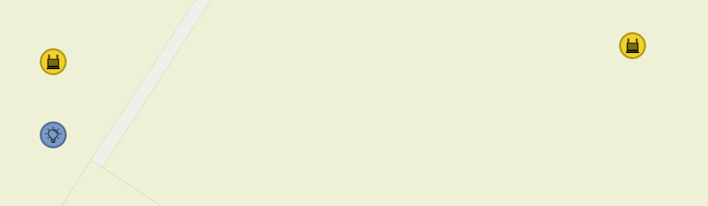
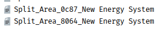
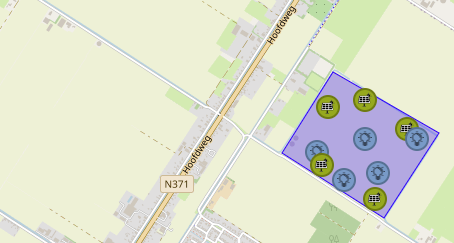
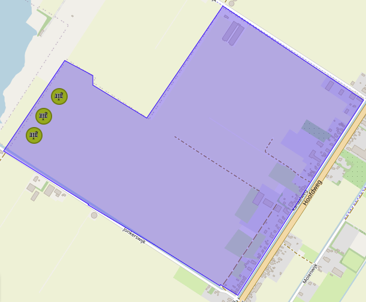

# Examples

---

In this page different DSL statement examples and their results within the energy system can be seen. For description about the syntaxes go to [Usage](statements.md) page.

## Add

Consider an energy system with two sub-areas. The top level area has ID <span class="code-variable">TOP_AREA</span>.


In order to add <span class="code-variable">1 PVPanel</span> and <span class="code-variable">1 ElectricityDemand</span> in each step for 5 steps, the following program can be used.

<pre v-pre data-lang="ESDL-DSL"><code>
<span class="code-keyword">OPEN</span> <span class="code-variable">base_model.esdl</span>

<span class="code-keyword-two">SELECT</span> <span class="code-variable">Area</span> FROM <span class="code-variable">TOP_AREA</span> AS <span class="code-variable">Areas</span>

<span class="code-keyword-two">ADD </span>FOR <span class="code-variable">5</span> STEPS:
- <span class="code-variable">1</span> <span class="code-variable">PVPanel</span> TO <span class="code-variable">Areas</span>
- <span class="code-variable">1</span> <span class="code-variable">ElectricityDemand</span> TO <span class="code-variable">Areas</span>
<span class="code-comment">
<span class="code-keyword">SAVE FINAL</span>
</pre></code>

Which results as:


## Remove


In order to remove all <span class="code-variable">ElectricityDemand</span> assets from Area2 (Area on the left), and remove 3 random <span class="code-variable">ElectricityDemand</span> from Area1 (Area on the right), following program can be used.

<pre v-pre data-lang="ESDL-DSL"><code>
<span class="code-keyword">OPEN</span> <span class="code-variable">base_model.esdl</span>

<span class="code-keyword-two">SELECT</span> <span class="code-variable">ElectricityDemand</span> FROM <span class="code-variable">Area2</span> AS <span class="code-variable">ED_2</span>

<span class="code-keyword-two">REMOVE </span>FOR <span class="code-variable">3</span> STEPS:
- <span class="code-variable">1</span> <span class="code-variable">ElectricityDemand</span> FROM <span class="code-variable">Area1</span>

<span class="code-keyword-two">REMOVE </span><span class="code-variable">ED_2</span>:

<span class="code-keyword">SAVE FINAL</span>
</pre></code>

Resulting as:


## Vary

Consider the following asset:

```xml
<asset xsi:type="esdl:PVInstallation" numberOfPanels=10 name="PVInstallation" minPower=100.0 id="PVI1"/>
```

In order to increase <span class="code-variable">numberOfPanels</span> by 5 in each step for 5 steps and multiply the <span class="code-variable">minPower</span> by 1.2 in each step for 5 steps, following program can be used.

<pre v-pre data-lang="ESDL-DSL"><code>
<span class="code-keyword">OPEN</span> <span class="code-variable">base_model.esdl</span>

<span class="code-keyword-two">VARY </span>FOR <span class="code-variable">5</span> STEPS:
- <span class="code-variable">numberOfPanels</span> OF <span class="code-variable">PVI1</span> <span class="code-variable">+5</span>

<span class="code-keyword-two">REMOVE </span>FOR <span class="code-variable">3</span> STEPS:
- <span class="code-variable">1</span> <span class="code-variable">ElectricityDemand</span> FROM <span class="code-variable">Area1</span>

<span class="code-keyword">SAVE FINAL</span>
</pre></code>

The asset in the final step will be:

```xml
<asset xsi:type="esdl:PVInstallation" numberOfPanels=35 name="PVInstallation" minPower=248.8 id="PVI1"/>
```

## Connect

To connect the <span class="code-variable">InPort</span> of <span class="code-variable">ElectricityDemand</span> in Area1 (Area on the right) to <span class="code-variable">PVP1</span>'s <span class="code-variable">OutPort</span> and connect all <span class="code-variable">ElectricityDemand</span> in Area2 (Area on the left) to closest PVPanel, following program can be used.

<pre v-pre data-lang="ESDL-DSL"><code>
<span class="code-keyword">OPEN</span> <span class="code-variable">base_model.esdl</span>

<span class="code-keyword-two">SELECT</span> <span class="code-variable">ElectricityDemand</span> FROM <span class="code-variable">Area1</span> AS <span class="code-variable">ED_1</span>
<span class="code-keyword-two">SELECT</span> <span class="code-variable">ElectricityDemand</span> FROM <span class="code-variable">Area2</span> AS <span class="code-variable">ED_2</span>

<span class="code-keyword-two">CONNECT </span>:
- <span class="code-variable">ED_1</span> <span class="code-variable">InPort</span> TO <span class="code-variable">PVP1 OutPort</span>
- <span class="code-variable">ED_2</span> <span class="code-variable">InPort</span> TO <span class="code-variable">CLOSEST PVPanel OutPort</span>

<span class="code-keyword">SAVE FINAL</span>
</pre></code>

Resulting as:


## Aggregate
Consider the following model with 4 <span class="code-variable">ElectricityDemand</span>s, 2 <span class="code-variable">Transformer</span>s placed Area with ID <span class="code-variable">Area1</span> and with two different carriers.

The <span class="code-variable">ElectricityDemand</span>s can be aggregated into a single asset with the following program.

<pre v-pre data-lang="ESDL-DSL"><code>
<span class="code-keyword">OPEN</span> <span class="code-variable">base_model.esdl</span>

<span class="code-keyword-two">AGGREGATE </span>:
- <span class="code-variable">Area1</span> <span class="code-variable">ElectricityDemand</span> USE <span class="code-variable">MEAN</span>

<span class="code-keyword">SAVE FINAL</span>
</pre></code>
Resulting as:



It is also possible to aggregate the assets by grouping them considering the carriers.

<pre v-pre data-lang="ESDL-DSL"><code>
<span class="code-keyword">OPEN</span> <span class="code-variable">base_model.esdl</span>

<span class="code-keyword-two">AGGREGATE </span>:
- <span class="code-variable">Area1</span> <span class="code-variable">ElectricityDemand</span> USE <span class="code-variable">MEAN</span> <span class="code-variable">BY CARRIER</span> 

<span class="code-keyword">SAVE FINAL</span>
</pre></code>


## Move
Consider the following energy system where all assets are placed on top level area with ID <span class="code-variable">top_area</span> in ESDL. However, they lie on lower level areas geographically.


```xml
    <area xsi:type="esdl:Area" id="top_area" name="Untitled area">
      <area xsi:type="esdl:Area" id="Area1" name="Area1">
        <geometry xsi:type="esdl:Polygon" CRS="WGS84">...
        </geometry>
      </area>
      <area xsi:type="esdl:Area" id="Area2" name="Area2">
      <geometry xsi:type="esdl:Polygon" CRS="WGS84">...
        </geometry>
      </area>
      <area xsi:type="esdl:Area" id="Area3" name="Area3">
        <geometry xsi:type="esdl:Polygon" CRS="WGS84">...
        </geometry>
      </area>
      <asset xsi:type="esdl:ElectricityDemand" name="ElectricityDemand_cd1e" id="cd1e9639-89ab-4195-83e2-50d275625e1d">
        <geometry xsi:type="esdl:Point" lat="52.95892807014909" lon="6.443985700607301" CRS="WGS84"/>
        <port xsi:type="esdl:InPort" name="In" id="7478706b-1a07-4e27-8a37-4f7657bc7c7f"/>
      </asset>
      <asset xsi:type="esdl:ElectricityDemand" name="ElectricityDemand_cd88" id="cd88f406-e6e9-4762-baa5-5e94ddc5cd34">
        <geometry xsi:type="esdl:Point" lat="52.95935462045223" lon="6.443953514099122" CRS="WGS84"/>
        <port xsi:type="esdl:InPort" name="In" id="10cf8873-38eb-4d13-941d-0a108413436c"/>
      </asset>
      <asset xsi:type="esdl:ElectricityDemand" name="ElectricityDemand_a34c" id="a34ce8b3-530c-4c20-8ce0-8f114762afd1">
        <geometry xsi:type="esdl:Point" lat="52.95993627317531" lon="6.4439642429351816" CRS="WGS84"/>
        <port xsi:type="esdl:InPort" name="In" id="862c49b2-02d9-4f04-81c2-8eb140b50745"/>
      </asset>
```
 Move mutation can be used to move these assets into geographical lowest areas.

<pre v-pre data-lang="ESDL-DSL"><code>
<span class="code-keyword">OPEN</span> <span class="code-variable">base_model.esdl</span>

<span class="code-keyword-two">MOVE</span>:
- FROM <span class="code-variable">top_area</span> TO <span class="code-variable">LOWEST</span>

<span class="code-keyword">SAVE FINAL</span>
</pre></code>
Resulting as:


```xml
    <area xsi:type="esdl:Area" id="top_area" name="Untitled area">
      <area xsi:type="esdl:Area" id="Area1" name="Area1">
        <asset xsi:type="esdl:ElectricityDemand" name="ElectricityDemand_cd1e" id="cd1e9639-89ab-4195-83e2-50d275625e1d">
          <port xsi:type="esdl:InPort" name="In" id="7478706b-1a07-4e27-8a37-4f7657bc7c7f"/>
          <geometry xsi:type="esdl:Point" lon="6.443985700607301" CRS="WGS84" lat="52.95892807014909"/>
        </asset>
        <geometry xsi:type="esdl:Polygon" CRS="WGS84">...
        </geometry>
        <area xsi:type="esdl:Area" id="Area2" name="Area2">
          <asset xsi:type="esdl:ElectricityDemand" name="ElectricityDemand_cd88" id="cd88f406-e6e9-4762-baa5-5e94ddc5cd34">
            <port xsi:type="esdl:InPort" name="In" id="10cf8873-38eb-4d13-941d-0a108413436c"/>
            <geometry xsi:type="esdl:Point" lon="6.443953514099122" CRS="WGS84" lat="52.95935462045223"/>
          </asset>
          <geometry xsi:type="esdl:Polygon" CRS="WGS84">...
          </geometry>
          <area xsi:type="esdl:Area" id="Area3" name="Area3">
            <asset xsi:type="esdl:ElectricityDemand" name="ElectricityDemand_a34c" id="a34ce8b3-530c-4c20-8ce0-8f114762afd1">
              <port xsi:type="esdl:InPort" name="In" id="862c49b2-02d9-4f04-81c2-8eb140b50745"/>
              <geometry xsi:type="esdl:Point" lon="6.4439642429351816" CRS="WGS84" lat="52.95993627317531"/>
            </asset>
            <geometry xsi:type="esdl:Polygon" CRS="WGS84">...
            </geometry>
          </area>
        </area>
      </area>
    </area>
```

## Replace
In order to replace the <span class="code-variable">Area2</span> (area on the left) with another area from another ESDL file replace mutation can be used. 


The area in the other esdl file named <span class="code-variable">replace.esdl</span>, has ID of <span class="code-variable">Area1</span>, so a program for this operation:

<pre v-pre data-lang="ESDL-DSL"><code>
<span class="code-keyword">OPEN</span> <span class="code-variable">base_model.esdl</span>

<span class="code-keyword-two">REPLACE</span>:
- <span class="code-variable">Area2</span> FROM <span class="code-variable">replace.esdl#Area1</span>

<span class="code-keyword">SAVE FINAL</span>
</pre></code>

Will give the following result.


## Split
Areas in the following energy system can be splitted into seperate ESDL files using the split mutation.


<pre v-pre data-lang="ESDL-DSL"><code>
<span class="code-keyword">OPEN</span> <span class="code-variable">base_model.esdl</span>

<span class="code-keyword-two">SPLIT</span>:

<span class="code-keyword">SAVE FINAL</span>
</pre></code>

The program's output will be two ESDL files. In each individual areas can be found.






## Merge
Consider the following energy system, where two areas with IDs <span class="code-variable">Area1</span> and <span class="code-variable">Area2</span> are to be merged. 


<pre v-pre data-lang="ESDL-DSL"><code>
<span class="code-keyword">OPEN</span> <span class="code-variable">base_model.esdl</span>

<span class="code-keyword-two">MERGE</span>:
- [<span class="code-variable">Area1</span>,<span class="code-variable">Area2</span>]
- 
<span class="code-keyword">SAVE FINAL</span>
</pre></code>

The program's output will be:


